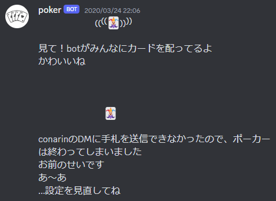
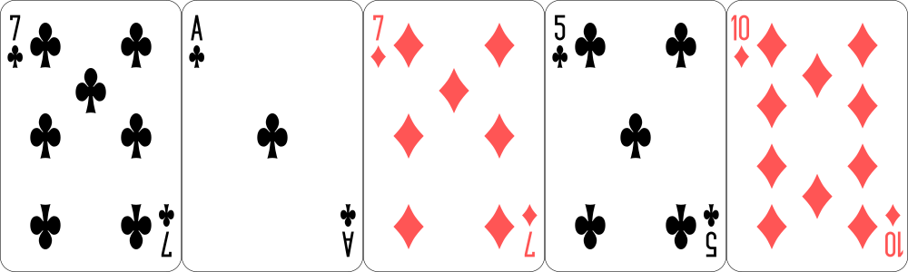
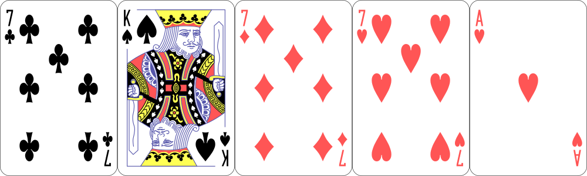
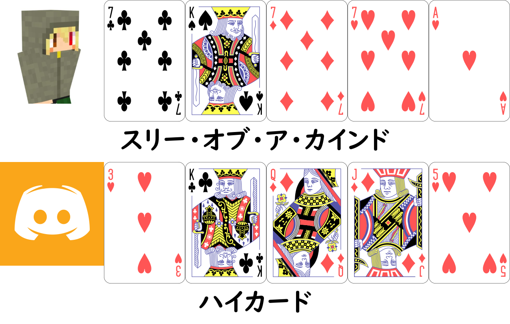

## 概要
本BotはGIGANTIC CASINOサーバーの専属非公開Botです。  
ゲーム内アイテムの「椎名林檎」を賭けて勝負することができます。

## 遊び方
本Botでは、以下のようにコマンドを入力します。
<DiscordMessages>
    <DiscordMessage>!poker [参加料]</DiscordMessage>
</DiscordMessages>
 

### 1. `!poker`と入力する
募集を開始します。募集開始後はリアクションを用いて参加、脱退、開始の操作ができます。  
:raised_hand:で参加、:wave:で脱退、:ok:で開始できます。  
募集開始から1分が経過すると自動で開始します。また、参加者が1人以下の場合は開始されずに終了します。

:::tip

`!poker`の後に半角のスペースを入れ、1以上64以下の整数値を半角のアラビア数字で入力することで、参加料を設定することができます。
<DiscordMessages>
    <DiscordMessage>!poker 32</DiscordMessage>
</DiscordMessages>

:::

### 2. DMにカードが配られる
今後のやり取りはゲーム終了まで全てDMチャンネルかテキストチャンネルで行われます。  

:::note

DMに送信できなかった場合(Botをブロックしている、DMの受け取りを拒否しているなど)、ゲームは強制終了します。  
プレイ前にDMにメッセージを送信できる状態かご確認ください。

:::

### 3. アクションする
プレイヤーは`bet`、`call`、`raise`、`check`、`fold`のいずれかを入力します。  
その時々によって使用できるアクションは違います。Botが使用できるアクションを指示するため、その中から選択します。  
また、カードの操作はBotが行うため「親」の概念はありません。アクションは参加順に行います。
:::info

- bet  
椎名を賭けること。誰かがbetした後は使用できない。
- call  
前の人と同じ額の椎名を賭けること。
- raise  
前の人よりも多い額の椎名を賭けること。
- check  
椎名を賭けずにパスすること。誰かがbetをした後は使用できない。
- fold  
ゲームを降りる。参加料や賭けた椎名は戻らない。

:::

:::warning

アクションがないまま1分が経過するとそのプレイヤーは強制的に棄権となります。  
棄権となっても参加料や賭けた椎名は戻りません。

:::

#### betとraiseの入力方法
betとraiseは入力後、いくら賭けるかを問われます。半角のアラビア数字で整数値を入力します。
:::tip

`bet 16`や`raise 32`のようにアクションの時点で半角のスペースで区切って入力することもできます。

:::

### 4. カードを交換する
[2. DMにカードが配られる](#2-dmにカードが配られる)でDMに送られたカードを確認し、交換したいカードの番号を入力します。  
番号は画像の左から`1`、`2`、`3`、`4`、`5`です。交換したいカードの番号を半角のスペースで区切って入力します。
<DiscordMessages>
    <DiscordMessage>2 4 5</DiscordMessage>
</DiscordMessages>
 

↓

また、カードを交換しない場合は`0`と入力します。
<DiscordMessages>
    <DiscordMessage>0</DiscordMessage>
</DiscordMessages>

### 5. アクションする
2回目のアクションです。交換したカードを参考に、アクションを決めます。  
内容は[3. アクションする](#3-アクションする)と同じため省略します。

### 6. 結果を祈る
全員のアクションが終わり次第、Botが役の判定を行い、結果を表示します。  
埋め込みにプレイヤーごとの支払額が表示されるため、ゲーム内でアイテムを交換します。

