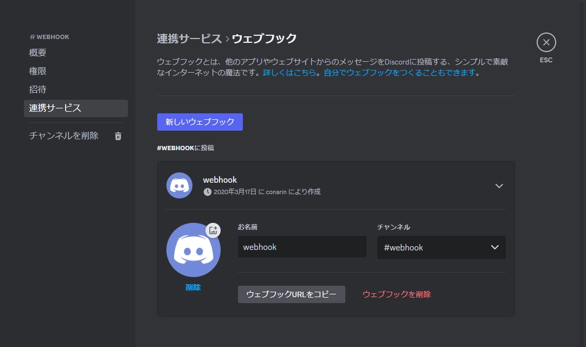

<DiscordMessages>
    <DiscordMessage><DiscordMention>[非公式] 整地鯖Bot</DiscordMention> schedule \<サブコマンド></DiscordMessage>
</DiscordMessages>
 

任意のコマンドを指定した時刻に実行します。  
コマンド名は`cron`、`interval`、`webhook`でも可能です。

:::note

このコマンドはDMチャンネルのみで使用できます。

:::

## サブコマンド
| サブコマンド名           | 概要                 |
|-------------------|--------------------|
| [add](#add)       | 自動実行させるコマンドを登録します。 |
| [remove](#remove) | 登録したコマンドを削除します。    |
| [list](#list)     | 登録したコマンド一覧を表示します。  |

---

### add
<DiscordMessages>
    <DiscordMessage><DiscordMention>[非公式] 整地鯖Bot</DiscordMention> schedule add</DiscordMessage>
</DiscordMessages>
 

自動実行させるコマンドを登録します。  
サブコマンド名は`insert`、`ins`、`set`でも可能です。

:::note

- 1ユーザーにつき10件まで登録できます。
- 登録したウェブフックURLが無効になった場合(ウェブフックやチャンネルなどを削除した場合)、登録したコマンドは消去されます。

:::

こちらのコマンドは対話形式でコマンドを登録します。  
Botの指示通りに入力していただくとコマンドを登録できます。

#### 1. DMでコマンドを入力
<DiscordMessages>
    <DiscordMessage><DiscordMention>[非公式] 整地鯖Bot</DiscordMention> schedule add</DiscordMessage>
</DiscordMessages>

#### 2. 実行させるコマンドを入力
定期実行させるコマンドを<u>**メンションを付けずに**</u>入力します。
<DiscordMessages>
    <DiscordMessage>ranking type=build duration=daily</DiscordMessage>
</DiscordMessages>

#### 3. 実行させる間隔または日時を入力
##### 一定時間ごとに実行させる場合
一定の時間ごとに実行させる場合は、`0.25`、`0.5`、`1`、`2`、`3`、`6`、`12`、`24`のいずれかを入力します。

| 入力   | 実行時間                          |
|------|-------------------------------|
| 0.25 | 00:14, 00:29, 00:44 ... 23:59 |
| 0.5  | 00:29, 00:59, 01:29 ... 23:59 |
| 1    | 00:59, 01:59, 02:59 ... 23:59 |
| 2    | 01:59, 03:59, 05:59 ... 23:59 |
| 3    | 02:59, 05:59, 08:59 ... 23:59 |
| 6    | 05:59, 11:59, 17:59, 23:59    |
| 12   | 11:59, 23:59                  |
| 24   | 23:59                         |
<DiscordMessages>
    <DiscordMessage>0.25</DiscordMessage>
</DiscordMessages>

##### 特定の日時に実行させる場合
特定の日時に実行させる場合は、`<曜日> <時刻>`または`<日にち> <時刻>`を入力します。  
曜日は`<日月火水木金土>曜[日]`と入力します。日にちは`<1~31>日`または`毎日`と入力します。  
時刻は`<HH時MM分SS秒>`または`<HH:MM:SS>`と入力します。`HH`以降は省略することもできます。 

<DiscordMessages>
    <DiscordMessage>日曜日 23時59分</DiscordMessage>
</DiscordMessages>
<DiscordMessages>
    <DiscordMessage>1日 9</DiscordMessage>
</DiscordMessages>

#### 4. メッセージを送信するウェブフックURLを入力
<DiscordMessages>
    <DiscordMessage>[https://discord.com/api/webhooks/1234567890123456789/Thi$1s@DurnrnyT0kenF0rVVe6h00k](#)</DiscordMessage>
</DiscordMessages>
 

:::info

ウェブフックURLはチャンネル設定の連携サービスから作成や確認することができます。

:::

#### 5. 最終確認
先ほど設定した内容と、コマンドの結果が表示されます。  
表示内容に問題が無ければ`はい`または`yes`と入力します。  
やり直したい場合は`いいえ`または`no`と入力したのち、初めからやり直してください。
<DiscordMessages>
    <DiscordMessage>はい</DiscordMessage>
</DiscordMessages>

---

### remove
<DiscordMessages>
    <DiscordMessage><DiscordMention>[非公式] 整地鯖Bot</DiscordMention> schedule remove \<ID\></DiscordMessage>
</DiscordMessages>
 

登録したコマンドを削除します。
サブコマンド名は`rem`、`rm`、`delete`、`del`でも可能です。

| パラメータ名 | 概要                 | 必須  |
|--------|--------------------|-----|
| ID     | 登録時に発行されるIDを入力します。 | :o: |

---

### list
<DiscordMessages>
    <DiscordMessage><DiscordMention>[非公式] 整地鯖Bot</DiscordMention> schedule list</DiscordMessage>
</DiscordMessages>
 

登録したコマンド一覧を表示します。  
サブコマンド名は`ls`でも可能です。

## 例
<DiscordMessages>
    <DiscordMessage><DiscordMention>[非公式] 整地鯖Bot</DiscordMention> schedule add</DiscordMessage>
    <DiscordMessage><DiscordMention>[非公式] 整地鯖Bot</DiscordMention> cron delete 2</DiscordMessage>
    <DiscordMessage><DiscordMention>[非公式] 整地鯖Bot</DiscordMention> webhook list</DiscordMessage>
</DiscordMessages>