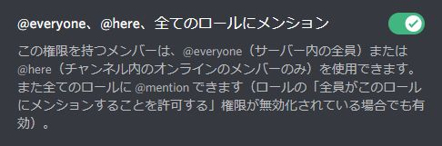
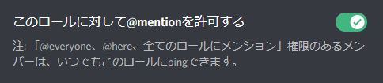
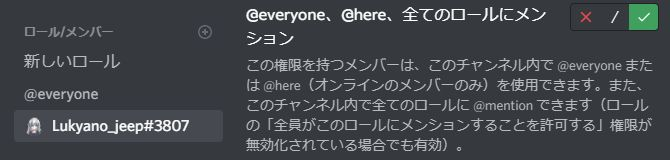
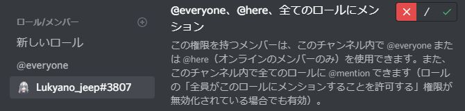
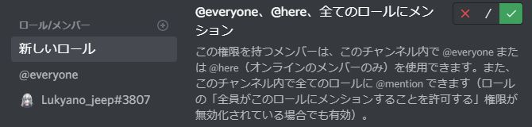
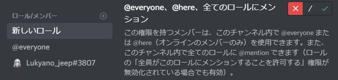
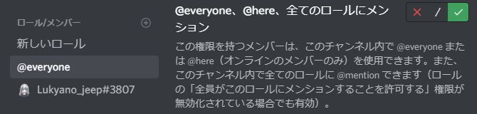
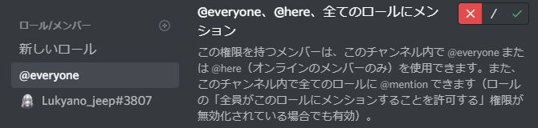
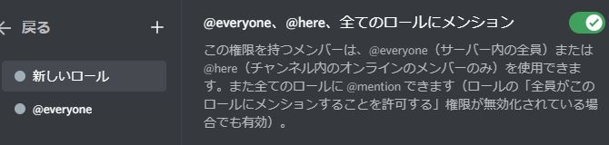
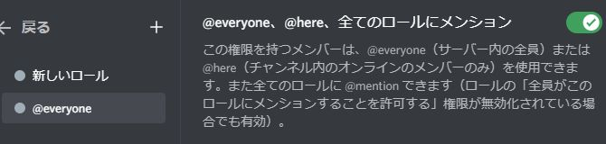

## メンションの条件
メッセージにユーザーやロールなどの<Mention>@メンション</Mention>を含めた場合は、以下の条件に従って通知されます。  
また、チャンネル設定での[権限の上書き](#権限の上書き)も考慮したうえで通知されます。

| 対象                                                        | 条件                                                                                                                                                                                                                                                              |
|-----------------------------------------------------------|-----------------------------------------------------------------------------------------------------------------------------------------------------------------------------------------------------------------------------------------------------------------|
| <Mention>@ユーザー</Mention> <Mention>@メンバー</Mention>     | 全てされます。                                                                                                                                                                                                                                                         |
| <Mention>@everyone</Mention> <Mention>@here</Mention> | タイマーをセットしたメンバーが`@everyone、@here、全てのロールにメンション`の権限を持っている場合されます。                                                                                                                          |
| <Mention>@ロール</Mention>                                   | タイマーをセットしたメンバーが`@everyone、@here、全てのロールにメンション`の権限を持っている場合、  または、ロールに`このロールに対して@mentionを許可する`が設定されている場合されます。  |

:::note

招待URLでは`@everyone、@here、全てのロールにメンション`の権限を<u>**要求していません**</u>。  
<Mention>@everyone</Mention>や<Mention>@here</Mention>、<Mention>@ロール</Mention>へメンションさせたい場合はBotに適切な権限を与えてください。  
メンションする権限がBotにない場合はメンションされませんのでご注意ください。

:::

:::warning

メンションを判別する仕組みの都合上、<u>**セットしたメッセージではメンションの表示になっていなくても、メンションの書き方になっているとメンションとして扱われる場合があります**</u>。  
そのため、インラインコードやコードブロック、エスケープなどの装飾を用いてもメンションとして扱われる場合があります。メッセージに@マークを含める際はご注意ください。  

:::

## 権限の上書き
Discordでは、チャンネルでの権限設定はサーバーでの権限設定を上書きします。また、許可のロールと拒否のロールの両方が設定されている場合、ロールの順序に関係なく許可が優先されます。  
例えば、チャンネルの設定でロールに対して`@everyone、@here、全てのロールにメンション`の権限を拒否している場合であっても、メンバーや別のロールに対して許可した場合、そのチャンネル内でのみ全てのロールにメンションすることができるようになります。
:::info

詳しくは[権限をセットアップするには？](https://support.discord.com/hc/ja/articles/206029707-%E6%A8%A9%E9%99%90%E3%82%92%E3%82%BB%E3%83%83%E3%83%88%E3%82%A2%E3%83%83%E3%83%97%E3%81%99%E3%82%8B%E3%81%AB%E3%81%AF)や[権限階層はどのように構成されていますか？](https://support.discord.com/hc/ja/articles/206141927-How-is-the-permission-hierarchy-structured)をご覧ください。  
さらに詳しく知りたい方は[開発者向けドキュメンテーション](https://discord.com/developers/docs/topics/permissions)をご覧ください。

:::

表で表すと以下のようになります。

| 優先度 | 設定場所                    | 画像                                                             |
|-----|-------------------------|----------------------------------------------------------------|
| 高   | チャンネル メンバー(許可)      |          |
|     | チャンネル メンバー(拒否)      |           |
|     | チャンネル ロール(許可)       |            |
|     | チャンネル ロール(拒否)       |             |
|     | チャンネル @everyone(許可) |        |
|     | チャンネル @everyone(拒否) |         |
|     | サーバー ロール            | 	           |
| 低   | サーバー @everyone      | 	       |